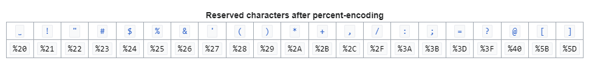

# MTG Vault


## Content

- [How the search works](#-How-the-search-works)
- [Precons order in folders](#Precons-Order-In-Folders)


## How the search works

### Main URL for scryfall API - https://api.scryfall.com/

**How the url could look**

https://api.scryfall.com/cards/search?include_extras=true&include_variations=true&order=set&q=e%3Aotc&unique=prints

### Breakdown of the url

***&*** - Between every parameter except after search becuase then you need '?' after search.

***include_extras=true*** - if extras cards should be included or not.

***include_variations=true*** - if different variations of each card should be included.

***order=set*** - In what order you want the cards to be sorted. Read more [here](#order).

***q=e%3Aotc*** - This is the search query and is built in a sertain way. See more detailed info [here](#Search-query).
 
***unique=prints*** - Returns all prints that exist for each card. Read more [here](#unique).

<br><br><br>

## Explainations from scryfall API docs

- ***q*** | String | A fulltext search query. Make sure that your parameter is properly encoded. Maximum length: 1000 Unicode characters.

- ***unique*** | String | The strategy for omitting similar cards. [See below](#unique).

- ***order*** | String | The method to sort returned cards. [See below](#order).

- ***dir*** | String | The direction to sort cards. [See below](#dir).

- ***include_extras*** | Boolean | If true, extra cards (tokens, planes, etc) will be included. Equivalent to adding include:extras to the fulltext search. Defaults to false.

- ***include_multilingual*** | Boolean | If true, cards in every language supported by Scryfall will be included. Defaults to false.

- ***include_variations*** | Boolean | If true, rare care variants will be included, like the Hairy Runesword. Defaults to false.

- ***page*** | Integer | The page number to return, default 1.

- ***format*** | String | The data format to return: json or csv. Defaults to json.
pretty

<br><br>

## Unique

- ***cards*** | Removes duplicate gameplay objects (cards that share a name and have the same functionality). For example, if your search matches more than one print of Pacifism, only one copy of Pacifism will be returned.

- ***art*** | Returns only one copy of each unique artwork for matching cards. For example, if your search matches more than one print of Pacifism, one card with each different illustration for Pacifism will be returned, but any cards that duplicate artwork already in the results will be omitted.

- ***prints*** - Returns all prints for all cards matched (disables rollup). For example, if your search matches more than one print of Pacifism, all matching prints will be returned.

<br><br>

## Order

So for example ***&order=set*** as in the url above its going to sort the cards by their set and then collector number.

- ***name*** | Sort cards by name, A → Z

- ***set*** | Sort cards by their set and collector number: AAA/#1 → ZZZ/#999

- ***released*** | Sort cards by their release date: Newest → Oldest

- ***rarity*** | Sort cards by their rarity: Common → Mythic

- ***color*** | Sort cards by their color and color identity: WUBRG → multicolor → colorless

- ***usd*** | Sort cards by their lowest known U.S. Dollar price: 0.01 → highest, null last

- ***tix*** | Sort cards by their lowest known TIX price: 0.01 → highest, null last

- ***eur*** | Sort cards by their lowest known Euro price: 0.01 → highest, null last

- ***cmc*** | Sort cards by their mana value: 0 → highest

- ***power*** | Sort cards by their power: null → highest

- ***toughness*** | Sort cards by their toughness: null → highest

- ***edhrec*** | Sort cards by their EDHREC ranking: lowest → highest

- ***penny*** | Sort cards by their Penny Dreadful ranking: lowest → highest

- ***artist*** | Sort cards by their front-side artist name: A → Z

- ***review*** | Sort cards how podcasts review sets, usually color & CMC, lowest → highest, with Booster Fun cards at the end

<br><br>

## Dir

- ***auto*** | Scryfall will automatically choose the most inuitive direction to sort

- ***asc*** | Sort ascending (the direction of the arrows in the previous table)

- ***desc*** | Sort descending (flip the direction of the arrows in the previous table)

<br><br>

## Search query


Here comes the tricky part. The search query is built in the way that you need to use [percent encoding](https://en.wikipedia.org/wiki/Percent-encoding). That means that for characters like **: ; | < >** and so on have an encoding that looks like this:


<br>


<br>

So every character has its encoding underneath. This means that if we want to write a ":" in the search query, we need to write "%3A". And this is important because the API expects certain ":" and so on in the search query. 

**From scryfall** - Use ***s:, e:, set:, or edition:*** to find cards using their Magic set code.

So this means that for it to be a ***e:*** we need to wright ***e%3A*** instead for the search to be accepted. 

Here's an example:

Set name OTC (Outlaws of Thunder Junction).
The search query would be ***e%3Aotc*** like this ***&q=e%3Aotc***. So its important to check the [scryfall docs](https://scryfall.com/docs/syntax) for knowing what they want for edition, cards, sets and so on. That way whe can get the wright information. 


<br><br><br>

## Precons order in folders

Here is the structure of the folders for all the sets and the included precons. In the precons md file there is a list where the amount is first and then the name of the card. This will make it easier to add a list of cards for the API to fetch so we can give the users the opportunity when they create a deck to choose a commander precon to start with.

Example: <br>
1 Access Tunnel <br>
1 Arcane Heist <br>
1 Arcane Signet <br>
1 Baleful Mastery <br>
1 Baleful Strix <br>
1 Bladegriff Prototype <br>
1 Brainstealer Dragon <br>


### Here's a list of all the folders and ***set*** folders and the ***set*** code for each and also links to the folder.

- **Commander Precons**
    - **2009**
        - **MTGO Commander** 
        <br> Set code: **TD0** 
        <br> [Link to folder](./Commander%20Precons/2009/MTGOCommander/)
    - **2011**
        - **Commander 2011** 
        <br> Set code: **CMD** 
        <br> [Link to folder](./Commander%20Precons/2011/Commander2011/)
    - **2013**
        - **Commander 2013** 
        <br> Set code: **C13** 
        <br> [Link to folder](./Commander%20Precons/2013/Commander2013/)
    - **2014**
        - **Commander 2014** 
        <br> Set code: **C14** 
        <br> [Link to folder](./Commander%20Precons/2014/Commander2014/)
    - **2015**
        - **Commander 2015** 
        <br> Set code: **C15** 
        <br> [Link to folder](./Commander%20Precons/2015/Commander2015/)
    - **2016**
        - **Commander 2016** 
        <br> Set code: **C16** 
        <br> [Link to folder](./Commander%20Precons/2016/Commander2016/)
    - **2017**
        - **Commander 2017** 
        <br> Set code: **C17** 
        <br> [Link to folder](./Commander%20Precons/2017/Commander2017/)
    - **2018**
        - **Commander 2018** 
        <br> Set code: **C18** 
        <br> [Link to folder](./Commander%20Precons/2018/Commander2018/)
    - **2019**
        - **Commander 2019** 
        <br> Set code: **C19** 
        <br> [Link to folder](./Commander%20Precons/2019/Commander2019/)
    - **2020**
        - **Commander Legends** 
        <br> Set code: **CMR** 
        <br> [Link to folder](./Commander%20Precons/2020/CommanderLegends/)
        - **Ikoria** 
        <br> Set code: **C20** 
        <br> [Link to folder](./Commander%20Precons/2020/Ikoria/)
        - **Zendikar Rising** 
        <br> Set code: **ZNC** 
        <br> [Link to folder](./Commander%20Precons/2020/ZendikarRising/)
    - **2021**
        - **Adventures In The Forgotten Realms** 
        <br> Set code: **AFR** 
        <br> [Link to folder](./Commander%20Precons/2021/AdventuresInTheForgottenRealms/)
        - **Commander 2021** 
        <br> Set code: **C21** 
        <br> [Link to folder](./Commander%20Precons/2021/Commander2021/)
        - **Innistrad Crimson Vow** 
        <br> Set code: **VOW** 
        <br> [Link to folder](./Commander%20Precons/2021/InnistradCrimsonVow/)
        - **Innistrad Midnight Hunt** 
        <br> Set code: **MID** 
        <br> [Link to folder](./Commander%20Precons/2021/InnistradMidnightHunt/)
        - **Kaldheim**
        <br> Set code: **KHM** 
        <br> [Link to folder](./Commander%20Precons/2021/Kaldheim/)
    - **2022**
        - **Commander Legends - Battle for Baldur's Gate**
        <br> Set code: **CLB** 
        <br> [Link to folder](./Commander%20Precons/2022/CommanderLegends-BFBG/)
        - **Dominaria United**
        <br> Set code: **DMC** 
        <br> [Link to folder](./Commander%20Precons/2022/DominariaUnited/)
        - **Kamigawa Neon Dynasty**
        <br> Set code: **NEO** 
        <br> [Link to folder](./Commander%20Precons/2022/KamigawaNeonDynasty/)
        - **Starter**
        <br> Set code: **SCB** 
        <br> [Link to folder](./Commander%20Precons/2022/Starter/)
        - **Streets Of New Capenna**
        <br> Set code: **SNC** 
        <br> [Link to folder](./Commander%20Precons/2022/StreetsOfNewCapenna/)
        - **The Brothers War**
        <br> Set code: **BRC** 
        <br> [Link to folder](./Commander%20Precons/2022/TheBrothersWar/)
        - **Warhammer 40.000**
        <br> Set code: **40K** 
        <br> [Link to folder](./Commander%20Precons/2022/Warhammer40000.md/)
    - **2023**
        - **Commander Masters**
        <br> Set code: **CMM** 
        <br> [Link to folder](./Commander%20Precons/2023/CommanderMasters/)
        - **Doctor Who**
        <br> Set code: **WHO** 
        <br> [Link to folder](./Commander%20Precons/2023/DoctorWho/)
        - **March Of The Machine**
        <br> Set code: **MOC** 
        <br> [Link to folder](./Commander%20Precons/2023/MarchOfTheMachine/)
        - **Phyrexia All Will Be One**
        <br> Set code: **ONC** 
        <br> [Link to folder](./Commander%20Precons/2023/PhyrexiaAllWillBeOne/)
        - **The Lords Of The Rings**
        <br> Set code: **LTC** 
        <br> [Link to folder](./Commander%20Precons/2023/TheLordsOfTheRings/)
        - **The Lost Caverns of Ixalan**
        <br> Set code: **LCC** 
        <br> [Link to folder](./Commander%20Precons/2023/TheLostCavernsofIxalan/)
        - **Wilds Of Eldraine**
        <br> Set code: **WOC** 
        <br> [Link to folder](./Commander%20Precons/2023/WildsOfEldraine/)
    - **2024**
        - **Fallout**
        <br> Set code: **PIP** 
        <br> [Link to folder](./Commander%20Precons/2024/Fallout/)
        - **Murders At Karlov Manor**
        <br> Set code: **MKC** 
        <br> [Link to folder](./Commander%20Precons/2024/MurdersAtKarlovManor/)
        - **Outlaws Of Thunder Junction**
        <br> Set code: **OTC** 
        <br> [Link to folder](./Commander%20Precons/2024/OutlawsOfThunderJunction/)
    - **Secret Lair** | Set code: **SLD** | [Link to folder](./Commander%20Precons/Secret-Lair/)


### Folder Structure for precons

```
└── 📁Commander Precons
    └── 📁2009
        └── 📁MTGOCommander
            └── DeathdancerXira.md
            └── EnchantressRubinia.md
    └── 📁2011
        └── 📁Commander2011
            └── Counterpunch.md
            └── DevourForPower.md
            └── HeavenlyInferno.md
            └── MirrorMastery.md
            └── PoliticalPuppets.md
    └── 📁2013
        └── 📁Commander2013
            └── EternalBargain.md
            └── EvasiveManeuvers.md
            └── MindSeize.md
            └── NatureOfTheBeast.md
            └── PowerHungry.md
    └── 📁2014
        └── 📁Commander2014
            └── BuiltFromScratch.md
            └── ForgedInStone.md
            └── GuidedByNature.md
            └── PeerThroughTime.md
            └── SwornToDarkness.md
    └── 📁2015
        └── 📁Commander2015
            └── CallTheSpirits.md
            └── PlunderTheGraves.md
            └── SeizeControl.md
            └── SwellTheHost.md
            └── WadeIntoBattle.md
    └── 📁2016
        └── 📁Commander2016
            └── BreedLethality.md
            └── EntropicUprising.md
            └── InventSuperiority.md
            └── OpenHostility.md
            └── StalwartUnity.md
    └── 📁2017
        └── 📁Commander2017
            └── ArcaneWizardry.md
            └── DraconicDomination.md
            └── FelineFerocity.md
            └── VampiricBloodlust.md
    └── 📁2018
        └── 📁Commander2018
            └── AdaptiveEnchantment.md
            └── ExquisiteInvention.md
            └── NaturesVengeance.md
            └── SubjectiveReality.md
    └── 📁2019
        └── 📁Commander2019
            └── FacelessMenace.md
            └── MercilessRage.md
            └── MysticIntellect.md
            └── PrimalGenesis.md
        └── 📁ThroneOfEldraineBrawl
            └── FaerieSchemes.md
            └── KnightsCharge.md
            └── SavageHunter.md
            └── WildBounty.md
    └── 📁2020
        └── 📁CommanderLegends
            └── ArmForBattle.md
            └── ReapTheTide.md
        └── 📁Ikoria
            └── ArcaneMaelstrom.md
            └── EnhancedEvolution.md
            └── RuthlessRegiment.md
            └── SymbioticSwarm.md
            └── TimelessWisdom.md
        └── 📁ZendikarRising
            └── LandsWrath.md
            └── SneakAttack.md
    └── 📁2021
        └── 📁AdventuresInTheForgottenRealms
            └── AuraOfCourage.md
            └── DraconicRage.md
            └── DungeonsOfDeath.md
            └── PlanarPortal.md
        └── 📁Commander2021
            └── LoreholdLegacies.md
            └── PrismariPerformance.md
            └── QuantumQuandrix.md
            └── SilverquillStatement.md
            └── WitherbloomWitchcraft.md
        └── 📁InnistradCrimsonVow
            └── SpiritSquadron.md
            └── VampiricBloodline.md
        └── 📁InnistradMidnightHunt
            └── CovenCounters.md
            └── UndeadUnleashed.md
        └── 📁Kaldheim
            └── ElvenEmpire.md
            └── PhantomPremonition.md
    └── 📁2022
        └── 📁CommanderLegends-BFBG
            └── DraconicDissent.md
            └── ExitFromExile.md
            └── MindFlayarrrs.md
            └── PartyTime.md
        └── 📁DominariaUnited
            └── LegendsLegacy.md
            └── Painbow.md
        └── 📁KamigawaNeonDynasty
            └── BuckleUp.md
            └── UpgradesUnleashed.md
        └── 📁Starter
            └── ChaosIncarnate.md
            └── DraconicDestruction.md
            └── FirstFlight.md
            └── GraveDanger.md
            └── TokenTriumph.md
        └── 📁StreetsOfNewCapenna
            └── BedeckedBrokers.md
            └── CabarettiCacophony.md
            └── MaestrosMassacre.md
            └── ObscuraOperation.md
            └── RiveteerRampage.md
        └── 📁TheBrothersWar
            └── MishrasBurnishedBanner.md
            └── UrzasIronAlliance.md
        └── 📁Warhammer40000.md
            └── ForcesOfTheImperium.md
            └── NecronDynasties.md
            └── TheRuinousPowers.md
            └── TyranidSwarm.md
    └── 📁2023
        └── 📁CommanderMasters
            └── EldraziUnbound.md
            └── EnduringEnchantments.md
            └── PlaneswalkerParty.md
            └── SilverSwarm.md
        └── 📁DoctorWho
            └── BlastFromThePast.md
            └── MastersOfEvil.md
            └── ParadoxPower.md
            └── Timey-Wimey.md
        └── 📁MarchOfTheMachine
            └── CallForBackup.md
            └── CavalryCharge.md
            └── DivineConvocation.md
            └── GrowingThreat.md
            └── TinkerTime.md
        └── 📁PhyrexiaAllWillBeOne
            └── CorruptingInfluence.md
            └── RebellionRising.md
        └── 📁TheLordsOfTheRings
            └── ElvenCouncil.md
            └── FoodAndFellowship.md
            └── HostsOfMordor.md
            └── RidersOfRohan.md
        └── 📁TheLostCavernsofIxalan
            └── AhoyMateys.md
            └── BloodRites.md
            └── ExplorersOfTheDeep.md
            └── Veloci-Ramp-Tor.md
        └── 📁WildsOfEldraine
            └── FaeDominion.md
            └── VirtueAndValor.md
    └── 📁2024
        └── 📁Fallout
            └── HailCaesar.md
            └── MutantMenace.md
            └── Science!.md
            └── ScrappySurvivors.md
        └── 📁MurdersAtKarlovManor
            └── BlameGame.md
            └── DeadlyDisguise.md
            └── DeepClueSea.md
            └── RevenantRecon.md
        └── 📁OutlawsOfThunderJunction
            └── DesertBloom.md
            └── GrandLarceny.md
            └── MostWanted.md
            └── QuickDraw.md
    └── 📁Secret-Lair
        └── Angels-TJLUBC.md
        └── FromCuteToBrute.md
        └── HeadsIWinTailsYouLose.md
        └── RainingCatsAndDogs.md
```